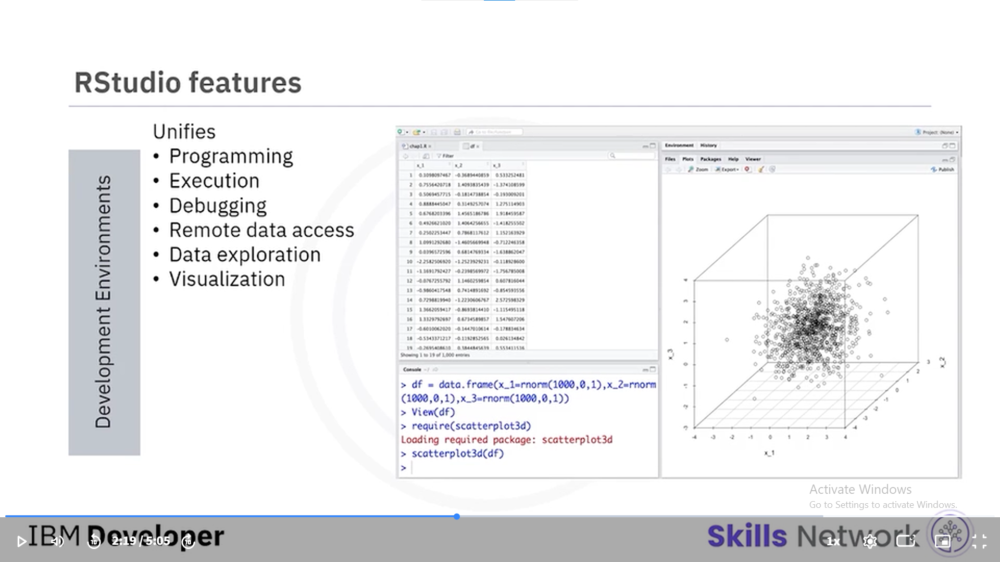

# 🛠️ Course 02: Tools for Data Science
## 🗺️ Data Science Categories & Ecosystem

To build a professional data science project, we need a complete ecosystem covering:
- **Data/Code Management:** Using Git/GitHub for version control.
- **Processing:** Data Integration, Transformation, and Visualization.
- **AI Core:** Model Building, Deployment, and continuous Monitoring.
- **Environments:** Development (where we write) and Execution (where we run).
### 🔄 Data Integration & Transformation (The Data Refinery)
This stage is about turning "Raw Data" into "Clean, Structured Insights" through:
- **ETL/ELT Processes:** Extracting data from sources and transforming it for analysis.
- **Data Cleansing:** Handling missing values and inconsistencies.
- **Tools used:**
  - **Spark:** Fast processing.
  - **Airflow:** Workflow orchestration.
  - **Kafka:** Real-time data streaming.
  ### 📊 Data Visualization: Seeing is Believing
Visualization is not just for the final report; it's a core tool for understanding data patterns.

- **Two Approaches:**
  - **Code-based:** Using libraries (e.g., Matplotlib, PixieDust).
  - **UI-based:** Using platforms with graphical interfaces (e.g., Superset, Kibana).
- **Tool Highlights:**
  - **Kibana:** Specialized in real-time logs and security monitoring.
  - **Superset:** Enterprise-grade, fast, and interactive dashboards.
  - **Hue:** Simplifies interacting with big data in the Hadoop ecosystem.
  ### 🚀 Model Deployment: Bringing AI to Life
Deployment is the final step where the trained model is integrated into a production environment to serve real users.

- **Framework Specific:** - **TF Serving** (Servers), **TF Lite** (Mobile), **TF.js** (Web).
- **Model Serving Engines:** - **Seldon:** For managing complex ML workflows at scale.
  - **MLeap:** For high-performance execution of Spark/Scikit-learn models.
- **Infrastructure:** - **Kubernetes:** The industry standard for automating deployment and scaling of containerized models.
### 🛡️ Model Monitoring & Trusted AI (Final Stage)
Once a model is deployed, it must be continuously monitored for performance, fairness, and security.

- **Infrastructure Monitoring:**
  - **ModelDB:** Version control for models (The "GitHub" for ML models).
  - **Prometheus:** Performance monitoring (CPU, RAM, and Latency).
- **IBM Trusted AI 360 Toolkit:**
  - **AI Fairness 360:** Detects and mitigates bias/discrimination in models.
  - **Adversarial Robustness 360:** Protects models against "Adversarial Attacks" (Crucial for Cybersecurity).
  - **AI Explainability 360:** Provides transparency by explaining "Why" a model made a specific decision.
  Note: Hadoop is for Data Storage, while tools like Apache Atlas are for Data Governance. They work together: Hadoop stores the bits, and Atlas manages the metadata and lineage.
  ### 📂 Data Asset Management (The Controller)
How do tools like Apache Atlas manage big data?
1. **Cataloging:** Creating a searchable inventory of all data assets.
2. **Lineage Tracking:** Visualizing the journey of data from source to destination.
3. **Governance:** Enforcing security policies and access control.
4. **Classification:** Tagging data based on sensitivity (e.g., PII - Personally Identifiable Information).
## 🗂️ Data Asset Management & Development Environments

### 📑 Data Asset Management (Governance & Lineage)
While tools like **Hadoop** store the data, management tools handle the "Who, What, and Where":
- **Apache Atlas / Egeria / Kylo:** These tools focus on **Data Governance** (security/access) and **Data Lineage** (tracking data origins).
- **Metadata Management:** Organizing "data about data" so it's searchable and compliant with regulations.

### 📓 Jupyter Notebooks
- **Versatility:** Supports over 100 languages (Python, R, Julia, etc.) via **Kernels**.
- **Interactive Coding:** Combines live code, equations, visualizations, and narrative text in one document.
- **Standards:** It's the industry standard for sharing data science workflows and experiments.
### 📓 Jupyter vs. Zeppelin: Choosing the right Notebook
While both are powerful Interactive Environments, they serve different needs:

- **Jupyter Notebook:** The gold standard for Python, R, and general data science experimentation.
- **Apache Zeppelin:** The preferred choice for **Big Data** and **Data Engineering** (Spark/SQL).
  - **Key Feature:** Built-in data visualization (no extra plotting code needed).
  - **Flexibility:** Better multi-user collaboration and grid-based layouts.
  ### 📓 Jupyter vs. Zeppelin: Choosing the right Notebook
While both are powerful Interactive Environments, they serve different needs:

- **Jupyter Notebook:** The gold standard for Python, R, and general data science experimentation.
- **Apache Zeppelin:** The preferred choice for **Big Data** and **Data Engineering** (Spark/SQL).
  - **Key Feature:** Built-in data visualization (no extra plotting code needed).
  - **Flexibility:** Better multi-user collaboration and grid-based layouts.

  
  ## 🛠️ Specialized Ecosystems
### ⚡ Execution Environments (Big Data Support)
- **Apache Spark:** Fast, in-memory data processing for massive datasets.
- **Apache Flink:** Best for real-time data streaming and processing.
- **Ray:** Advanced scaling for Python and Machine Learning workloads.

### 🧩 Fully Integrated Visual Tools
- **KNIME:** A GUI-based platform that allows building data science workflows without coding using a modular "node" approach.

### 🏢 Commercial Data Management Tools
- **Traditional RDBMS (Oracle, SQL Server, IBM DB2):** - Best for high-speed transactional data and structured storage.
  - Relies heavily on **SQL**.
- **The "Big Data" Shift:** - **Hadoop:** Provides distributed storage (HDFS) for massive, unstructured datasets.
  - **Spark:** Acts as the high-speed processing engine on top of Hadoop.
- **Data Warehouse vs. Data Lake:** - Data Warehouse (e.g., DB2) is for structured, business-ready insights.
  - Hadoop is often used as a "Data Lake" for raw, vast amounts of data.

  ### 🏢 Commercial Tools for Data Science
While open-source tools are flexible, enterprises use commercial tools for reliability and support.

- **Data Management:** - **Oracle Database, MS SQL Server, & IBM DB2:** Standard for managing structured data with high security and stability.
- **Model Building:**
  - **SPSS & SAS:** Advanced statistical tools used in healthcare and finance.
  - **IBM Watson Studio:** A comprehensive platform for collaborative AI development.
- **Model Deployment:**
  - **SPSS Collaboration and Deployment Services:** Automates and secures the process of bringing models into production.

 ### ✅ Data Science Tools Summary (IBM Course 02)
- **Open Source:** Best for flexibility and community support (Python/R ecosystem).
- **Commercial:** Best for enterprise security, stability, and "No-Code" solutions (IBM/Oracle/SAS).
- **Integration:** **IBM Watson Studio** is the "all-in-one" platform that covers the entire lifecycle.
- **Key Lesson:** Choose the tool based on data size, budget, and team skills.
 - **Informatica:** A leading commercial ETL tool used for high-end Data Integration and Transformation. 
- **Key advantage:** Visual drag-and-drop interface with enterprise-grade security and support.
### 📥 Post-Processing Storage Strategy
Where does data go after processing?
1. **Back to Hadoop (Data Lake):** For large-scale ML models and further research. (Cost-effective for Big Data).
2. **To SQL Databases (Data Warehouse):** For business reporting, dashboards, and fast querying. (Structured & high performance).
- **Pro Tip:** Modern architectures use both to balance between "Scale" (Hadoop) and "Speed" (SQL).